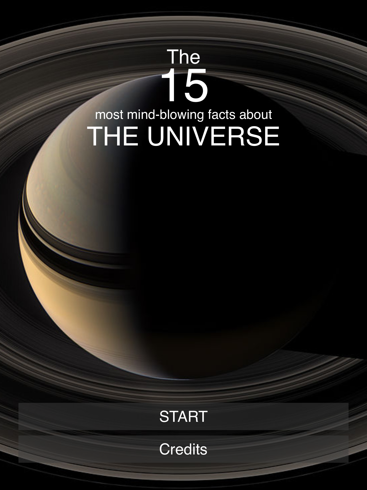
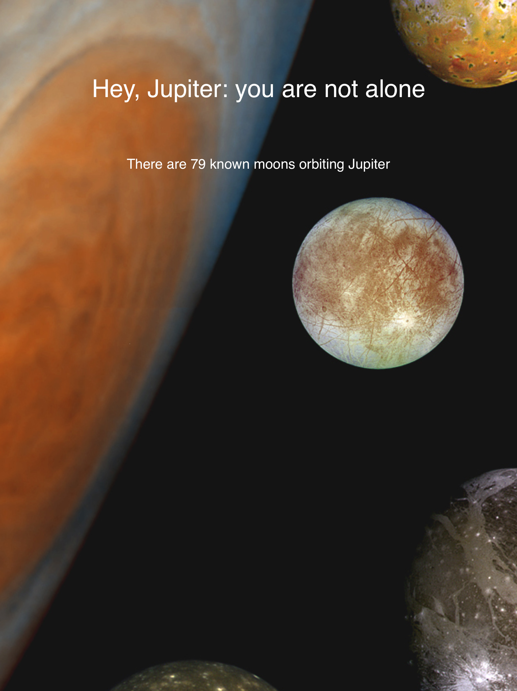
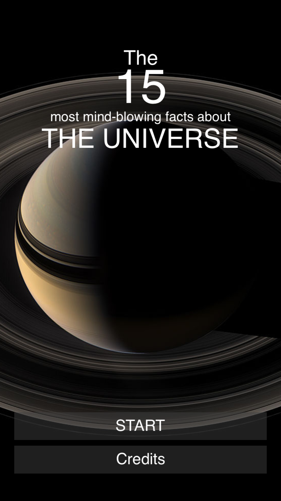
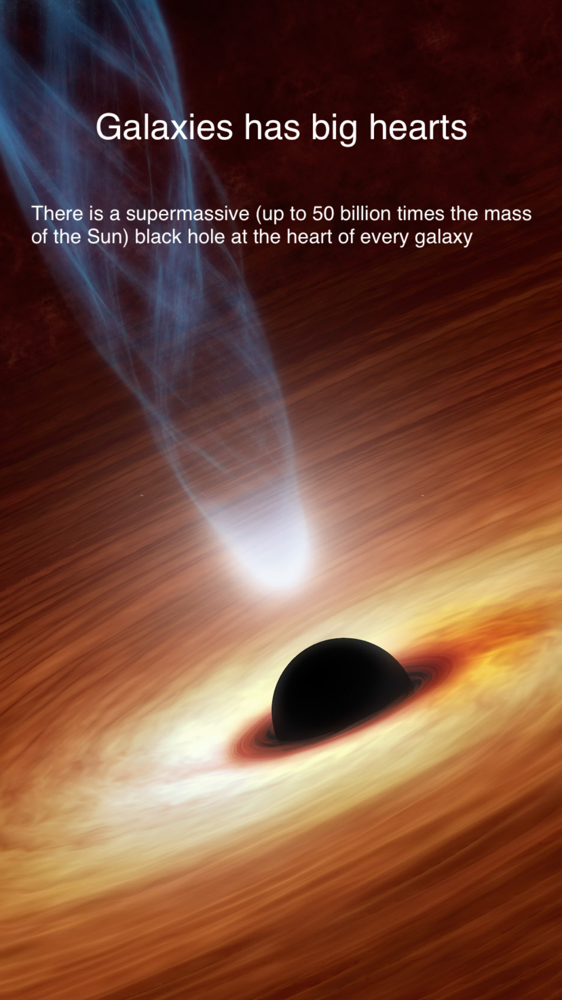

# The 15 most mind-blowing facts about the universe

Go on an unforgettable discovery experience as you navigate through fascinating facts and wonderful pictures of our universe!. Complete it on a few minutes, and share the experience with friends and relatives whenever you want.

A [Boken Engine](https://github.com/boken-engine/boken-engine/) powered application free to everyone.

Application screenshots:

iPad Pro:

    

iPhone 8:

   
